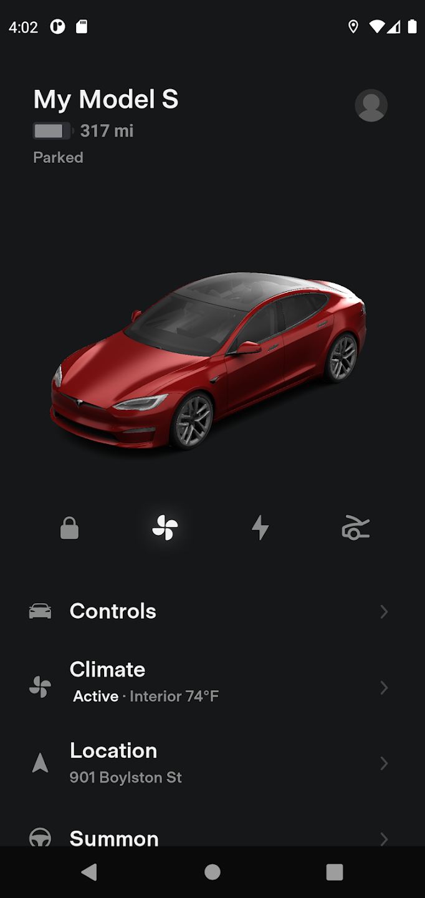
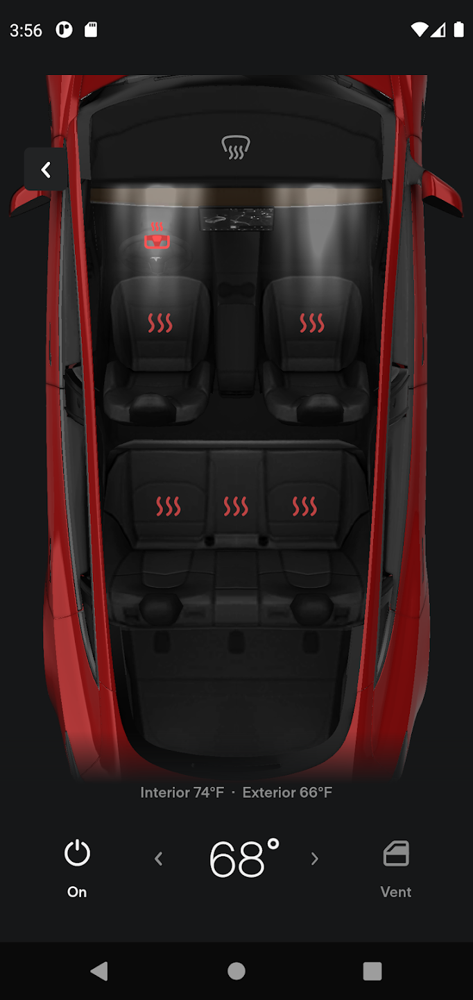

# Introduction to the Tesla App

## 📸 Screenshots

| Home Screen                            | Charging Screen                            | Settings Screen                            |
| -------------------------------------- | ------------------------------------------ | ------------------------------------------ |
|  |  |  |

## 📝 Description

This app was built using React Native with expo router and expo icons. It is a clone of the Tesla app. It is a simple app that has a home screen, a charging screen, and a settings screen. The app is built using expo and can be run on an android or ios device.

## 🚀 How to use

```sh

git clone

npm install

npm start

```

## Technologies Used

- React Native
- Expo
- Expo Vector Icons
- Expo Router

## 📝 Notes

Use [`expo-router`](https://expo.github.io/router) to build native navigation using files in the `app/` directory.

## 🚀 How to create a react native project with router as default

```sh
npx create-expo-app -e with-router
```
